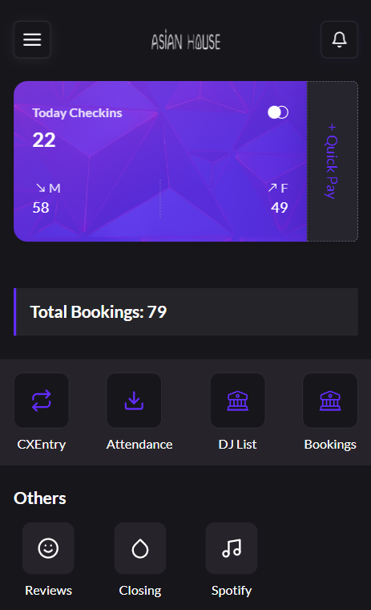
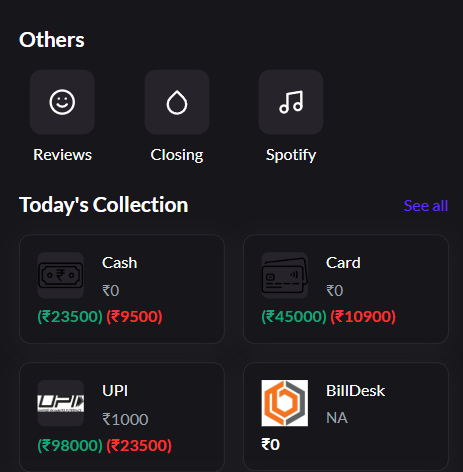
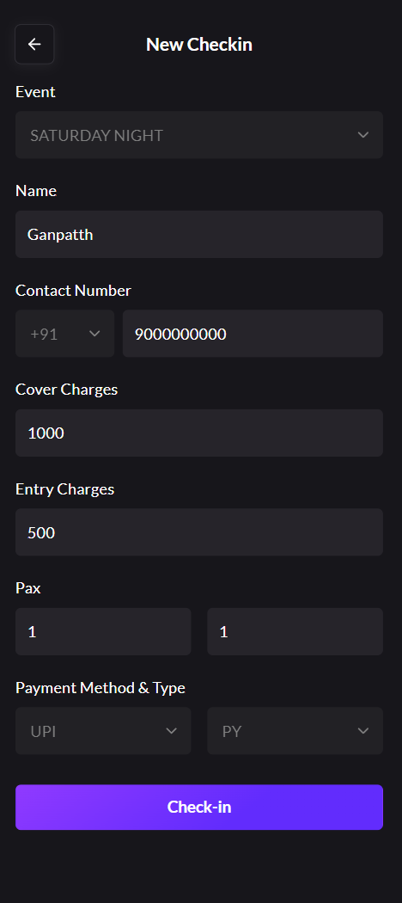
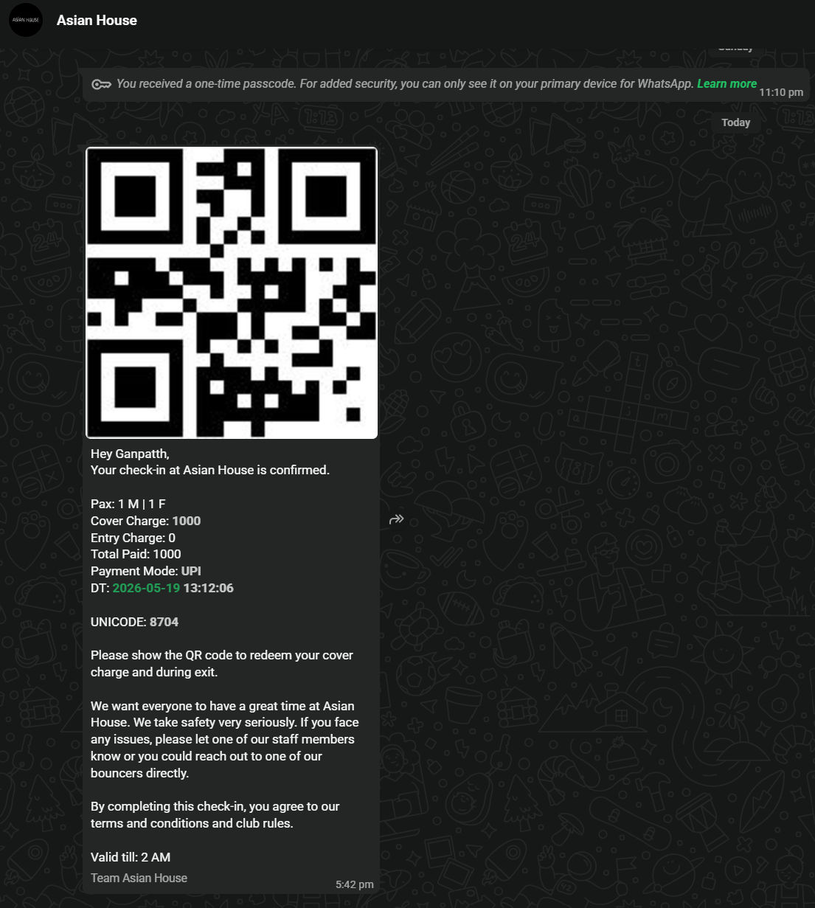
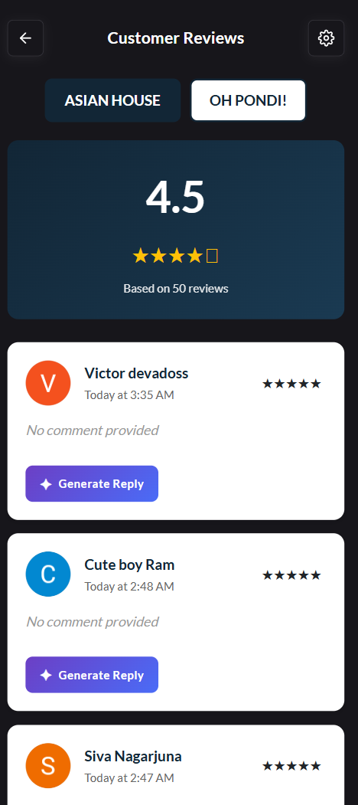
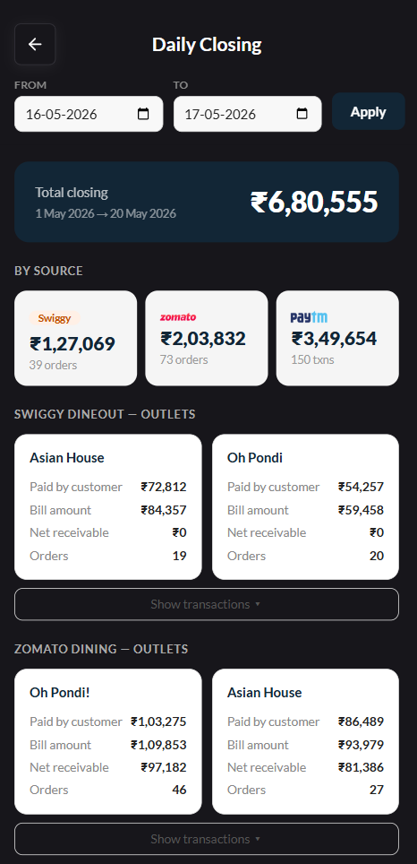

# AHEMP — AH Employee Management Platform

> A proprietary operations and experience management app built. Designed from the ground up for bars and clubs — handling everything from door entry to day-end closing, DJ scheduling, ad lead tracking, and customer reviews.

---

## Table of Contents

- [Overview](#overview)
- [Features](#features)
  - [Dashboard](#dashboard)
  - [CX Entry (Check-In)](#cx-entry-check-in)
  - [WhatsApp Confirmation](#whatsapp-confirmation)
  - [Today's Bookings & Ad Leads](#todays-bookings--ad-leads)
  - [Today's Collection](#todays-collection)
  - [DJ Lineup Manager](#dj-lineup-manager)
  - [Reviews](#reviews)
  - [Closing](#closing)
  - [Attendance](#attendance)
- [Integrations](#integrations)
- [Coming Soon](#coming-soon)
- [In Testing](#in-testing)
- [Architecture Notes](#architecture-notes)

---

## Overview

**AHEMP** is a full-stack mobile-first application built to streamline the day-to-day operations big bars and clubs. It replaces fragmented manual processes — paper entry logs, WhatsApp forwards, spreadsheet closing reports — with a single unified platform accessible from any device.

The platform is currently deployed for **Asian House** with the architecture designed to support multiple outlets in the future.

---

## Features

---

### Dashboard

The main landing screen gives managers and staff a real-time pulse on the night's operations.

**What's on the Dashboard:**

- **Today Check-ins** — Live count of total check-ins for the day with a Male/Female breakdown
- **Quick Pay** — A built-in fallback payment option with integrated payment gateway, used when the EDC (card swipe) machine is unavailable. Allows direct collection from customers without interruption
- **Total Bookings** — Shows the count of bookings for the day sourced from ad leads and direct reservations
- **Module Shortcuts** — Quick access to CX Entry, Attendance, DJ List, Bookings, Reviews, Closing, and Spotify
- **Today's Collection** — Payment breakdown by mode (see [Today's Collection](#todays-collection))

---

### CX Entry (Check-In)

The entry screen is used by the door staff to register every customer walking into the venue.

**Fields captured at entry:**

| Field | Description |
|---|---|
| Event | Select the event/night type (e.g. HD) |
| Name | Customer's name |
| Contact Number | Mobile number with country code |
| Cover Charges | Amount charged as cover (redeemable at the bar) |
| Entry Charges | Separate entry fee if applicable |
| Pax | Number of Male and Female guests in the group |
| Payment Method & Type | e.g. UPI / Card / Cash, and the payment type category |

Once submitted via the **Check-in** button:
- The entry is logged and the cover charge redemption is synced with the POS system
- A WhatsApp confirmation is automatically sent to the customer

---

### WhatsApp Confirmation

Immediately after a successful check-in, the customer receives an automated WhatsApp message using Whatsapp Business API.

**The message includes:**

- Personalised greeting with the customer's name
- Pax breakdown (Male | Female)
- Cover Charge and Entry Charge amounts
- Total paid and payment mode
- Date & time of check-in
- A unique **Unicode** reference code
- A **QR Code** — to be shown at the time of bill payment to redeem the cover charge
- Validity (valid till closing time e.g. 2 AM)
- Safety and club rules note

This removes the need for paper tokens or manual reconciliation of cover charge redemptions. The QR is scanned at the table during settlement, and the cover amount is automatically deducted from the final bill via POS integration.

---

### Today's Bookings & Ad Leads

The Bookings/Reservations screen aggregates incoming leads from advertising platforms and provides a live view of who's expected for the night.

**Stats shown:**

- Total Reservations
- Total Guests
- Male Guests / Female Guests breakdown

**Lead Source Tagging:**

Each reservation is tagged with the source it came from — for example:

- `Google Ads`
- `Meta Ads`

This allows management to directly measure the ROI of their advertising campaigns by seeing how many actual walk-ins were generated per ad platform on any given night. Customer contact details and pax are visible per entry, with timestamps.

---

### Today's Collection

Accessible from the Dashboard by tapping **See All**, this section shows a real-time breakdown of all entry and cover charge payments collected at the door.

**Payment modes tracked:**

| Mode | Description |
|---|---|
| Cash | Physical cash collected at entry |
| Card | EDC / card swipe payments |
| UPI | UPI payments (GPay, PhonePe, etc.) |
| BillDesk | Online payment gateway collections |

Tapping **See All** opens the full customer list for the day, showing:
- Customer name, contact, and pax details
- Editable fields for Admins (Pax & Contact)
- **OTP Resend** option — in case the customer did not receive the WhatsApp message

---

### DJ Lineup Manager

Owners and managers can plan, assign, and track DJ bookings for the entire month from this screen.

**DJ Management:**
- Add new DJs to the roster
- Select any DJ to view or edit their profile and rates

**Slots Management:**
- Search for which DJ is assigned to any given date
- Add new slots with date, time, and DJ assignment
- View per-slot payment status: `Paid` or `Unpaid`
- Edit or delete any slot
- Transaction reference (TXN) visible for paid slots

**Monthly Statistics:**

| Metric | Description |
|---|---|
| Total Spend | Total DJ costs for the month |
| Total Slots | Number of DJ nights booked |
| Paid | Amount already disbursed |
| Unpaid | Outstanding payments |

Month navigation (Previous / Next) lets management plan and review across months.

---

### Reviews

<!-- 📸 SCREENSHOT PLACEHOLDER — Add reviews screen screenshot here -->
<!-- Example:  -->

The Reviews module fetches **real-time reviews from the Google Business Profile** of two different outlets.

**Features:**
- Live feed of incoming customer reviews
- AI-powered response generation using **Gemini** — generates contextually appropriate replies to each review
- Staff can **edit** the AI-generated response before posting
- Helps maintain consistent and prompt engagement on the Google listing

---

### Closing

<!-- 📸 SCREENSHOT PLACEHOLDER — Add closing/day-end screen screenshot here -->
<!-- Example:  -->

The Closing module simplifies the end-of-day reconciliation process by automatically pulling in sales data from all integrated payment platforms.

**Integrated sources for closing:**

| Source | Description |
|---|---|
| Paytm (EDC) | Card and POS terminal settlements |
| Zomato Dining | Online payments via Zomato Dining |
| Swiggy Dining | Online payemtns via Swiggy Dineout |

The closing screen presents a consolidated view of total collections across all channels, which can be verified against the POS partner report — making EOD settlement a fast, auditable process rather than a manual reconciliation effort.

---

### Attendance

Staff attendance tracking module accessible from the main dashboard. Full details covered under the [Coming Soon](#coming-soon) section as enhanced biometric features are being rolled out.

---

## Integrations

| Integration | Purpose |
|---|---|
| **WhatsApp Business API** | Automated check-in confirmation with QR code |
| **POS System** | Entry data sync; cover charge redemption via QR at bill |
| **Payment Gateway** | Quick Pay fallback for card machine downtime |
| **Paytm EDC** | Day-end closing reconciliation |
| **Zomato Dining** | Online dining bookings & closing data |
| **Swiggy Dining** | Online dining bookings & closing data |
| **Google Ads** | Lead tracking & ad performance via bookings |
| **Meta Ads** | Lead tracking & ad performance via bookings |
| **Google Business Profile** | Real-time review fetching |
| **Gemini AI** | AI-generated responses for Google Reviews |
| **BillDesk** | Online payment collection tracking |

---

## Coming Soon

### DJ Dashboard
DJs will be able to directly sign up on AHEMP and self-manage their schedule. Features planned:
- DJ self-registration and profile creation
- Schedule their own show dates
- View and manage payment status
- Communicate availability directly through the app

### Spotify Integration for Staff
Staff will be able to control the venue's music directly from the app, eliminating dependency on a dedicated master device.
- Browse and queue tracks
- Control playback
- Manage playlists per event type

### Staff Attendance — Biometric & Geolocation
A comprehensive attendance and payroll system for venue staff:
- **Face Recognition** attendance marking
- **Fingerprint** based sign-in
- **Geolocation fencing** — attendance only valid within the venue premises
- Preset shift management (opening, floor, bar, closing)
- Auto salary computation based on:
  - Days present / absent
  - Late arrivals
  - Overtime shifts
  - Leave balances
- Staff self-service view — employees can see their own attendance and calculated pay in real time

---

## In Testing

### Inventory Management System
Currently under development and testing before production deployment.

**Goal:** Reduce alcohol wastage and ensure pour accuracy across the bar.

**Approach:**
- Track stock at bottle level
- Use alcohol percentage and volume mathematics to calculate expected remaining quantity per bottle
- Flag discrepancies between expected and actual inventory
- Generate reports for loss analysis and ordering decisions

> ⚠️ This feature is **not yet live**. Pending QA and mutliple validation for accuracy before rollout.

---

## Architecture Notes

- Built as a **mobile-first** application
- Designed to support **multi-outlet expansion** —  outlet-level configuration is part of the planned architecture
- All sensitive credentials, API keys, and backend configuration are managed via environment variables and are **not included in this repository**
- The source code is **proprietary and confidential** — this README exists for documentation and onboarding purposes only

---

> **AHEMP** is a proprietary product. Unauthorised distribution, reproduction, or use of this software is strictly prohibited.
>
> © 2026 Asian House. All rights reserved.
